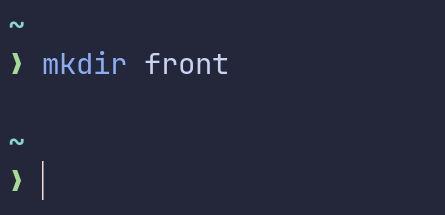
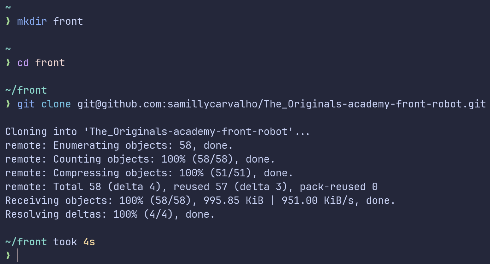
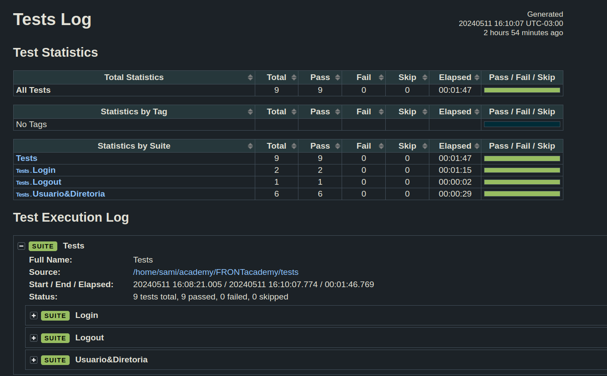

<h1>Projeto de Automação com robotframework</h1>


## Tecnologias
- Robot
- Python
- VScode
- Git


 ## Instalar as dependencias

### Baixar python 

- Python versão 3.11 

### Baixar robotframework

- pip install robotframework

### Instalar as librarys para o projeto

- pip install robotframework-seleniumlibrary
### Cria uma pasta 

Dentro da pasta criada dê o git clone.

### Clone do projeto
```jsx
git clone git@github.com:samillycarvalho/The_Originals-academy-front-robot.git
```


### Entre no diretorio

```jsx
cd The_Originals-academy-front-robot
```

### Entre no vscode

Dentro do diretorio você utiliza esse comando

```jsx

code .
```

### Executando os testes

   robot -d results ./tests/nome-do-teste
  ex: robot -d resuts ./tests/login.robot

#### ou execute todos os testes como no exemplo abaixo:
```jsx

 robot -d resuts ./tests/
```
## Resultados



## Projeto desenvolvido por:
- [@samillycarvalho](https://www.linkedin.com/in/s%C3%A2milly-carvalho-444638226/)
- [@TainaLourenco](https://www.linkedin.com/in/taina-louren%C3%A7o-costa-da-silva/)
# The_Originals-academy-front-robot
